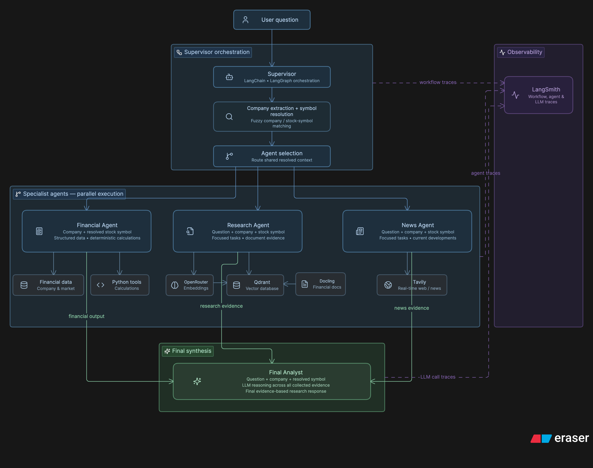

# SmartFolio

> AI-assisted equity research that combines financial data, RAG-based research, and real-time news into an evidence-backed analysis.

## Built With

<div align="center">
  
  
  
  
</div>

---

## Features

- Natural-language stock and company research
- Multi-agent analysis with LangGraph
- Fuzzy company and stock-symbol matching
- Financial analysis with deterministic calculations
- RAG-based research using Docling and Qdrant
- Semantic search with OpenRouter embeddings
- Real-time news research using Tavily
- Parallel execution of independent agents
- Cross-source synthesis with LLMs
- End-to-end observability with LangSmith

---

## System Architecture



---

## Installation

```bash
uv venv
source .venv/bin/activate
uv pip install -e .
```

Create a `.env` file:

```dotenv
OPENROUTER_API_KEY=...
TAVILY_API_KEY=...
INDIAN_API_KEY=...
QDRANT_URL=...
QDRANT_API_KEY=...
```

## Usage

Ask a question about a single company:

```bash
smartfolio "How are Wipro's financials looking?"
```

```bash
smartfolio "What are the recent risks for HCL Technologies?"
```

Save the analysis to a file:

```bash
smartfolio "What are the recent risks for HCL Technologies?" -o analysis.txt
```

View available options:

```bash
smartfolio --help
```

Check the installed version:

```bash
smartfolio --version
```

---
